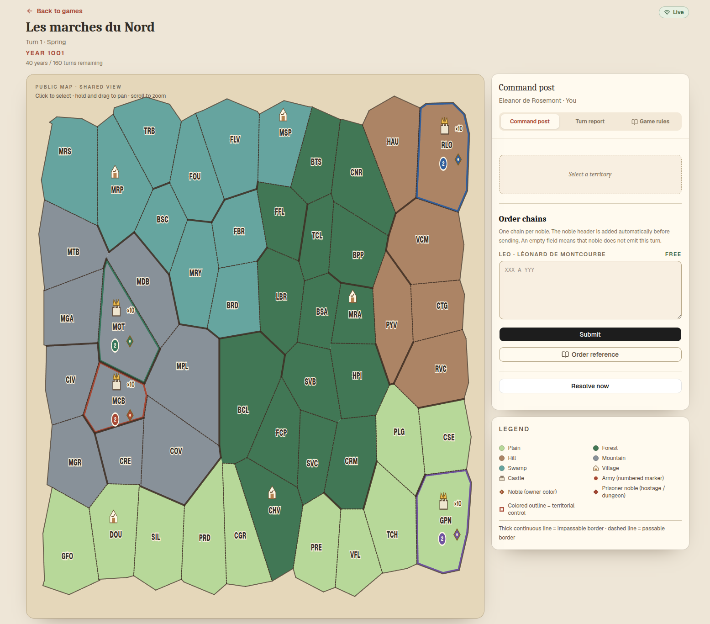

# Crown & Borough



## Usage

The Go binary serves the API and the compiled frontend from the same origin.

1. Run `make run-hotseat` (or its `make run-dev` alias) for the local memory
   game and legacy embedded frontend on port 8080.
2. Run `make run-online` for the local Go binary with Auth and Firestore
   emulators, or `make compose-up` for the same flow in Docker.
3. Open http://localhost:8080.

`make web-dev` remains available for fast frontend-only iteration. In that mode
Vite proxies `/api` to the separately running Go server; it is not required to
run the compiled application.

`make run-hotseat` always rebuilds the embedded frontend with the Firebase Web
variables empty, even when `web/.env.local` is configured for the emulator
flow. `make run-online` and `make compose-up` deliberately use those public
variables instead.

## Git Workflow

The repository uses two long-lived branches:

| Branch | Role | Deployment |
| --- | --- | --- |
| `main` | Protected release branch | A `v*` tag is deployed automatically |
| `develop` | Protected integration branch for work in progress | Never deployed directly |

Short-lived branches must use a prefix that describes their change:

| Branch | Pull request target | Release label |
| --- | --- | --- |
| `fix/*` or `bugfix/*` | `main` | `release:patch` |
| `ux/*` | `main` | `release:patch` or `release:minor` |
| `feat/*` or `feature/*` | `develop` | `release:minor` or `release:major` |
| `chore/*`, `docs/*`, `refactor/*`, `test/*`, `ci/*`, `build/*` | `develop` | No release label unless the change is intentionally released |

Every pull request title follows Conventional Commits, for example
`fix(api): reject an expired invitation`. The final SemVer bump is determined
by that title and its breaking-change marker: `fix` and other non-feature
changes that are included in the changelog produce a patch, `feat` produces a
minor version, and `!` or a `BREAKING CHANGE` footer produces a major version.
Maintenance-only commits such as hidden `chore`, `test`, `ci`, or `build`
changes do not create a release by themselves. The `release:*` label is an
explicit declaration checked by the pull request policy; it does not replace
the Conventional Commit title.

The normal flows are:

1. Start `feat/*` work from `develop` and merge it back into `develop`.
2. Start `fix/*` and `ux/*` work from `main` and merge it into `main`.
3. When the features in `develop` are ready, open a promotion pull request from
   `develop` to `main`.
4. release-please opens or updates a release pull request on `main`. Merge it
   after review and CI; it creates the SemVer tag and GitHub release notes.
5. The `v*` tag starts the Cloud Run and Firebase Hosting deployment. There is
   no deployment on an ordinary push to `main` and no manual deploy trigger.

After every change to `main`, the synchronization workflow prepares a direct
`main` to `develop` pull request. It requests automatic merge after the checks
pass. The sync uses a merge commit intentionally, so do not require linear
history on `develop`; if GitHub reports a conflict, resolve that pull request
manually. Do not create a second manual synchronization pull request.

Protect both long-lived branches in GitHub. Require a pull request, at least
one approval, the `CI` jobs and `Pull Request Policy` checks, and disable force
pushes and branch deletion. Allow squash merges for normal work and allow
merge commits on `develop` for the synchronization workflow. Configure the
repository to allow squash and merge commits but not rebase merges; require
linear history on `main` so normal release work is squash-merged. Enable
automatic merge and allow GitHub Actions to create pull requests. Required
reviews still apply to the synchronization PR, so it waits for an approval if
`develop` is configured with the same review rule. The release workflow and the
synchronization workflow use the `RELEASE_PLEASE_TOKEN` repository secret;
setup details are in [`docs/deploy-cloudrun.md`](docs/deploy-cloudrun.md). If
automatic merge cannot be queued, the synchronization workflow fails visibly
so the repository settings or the pull request can be corrected.

Create the `release:patch`, `release:minor`, `release:major`,
`autorelease: pending`, and `autorelease: tagged` labels in the repository. The
labeler adds a type label from the source branch. The two `autorelease:*`
labels are used by release-please to track its release pull request.

For the initial setup, create `develop` from the current release branch and
push it once before enabling branch protection:

```bash
git fetch --prune origin
git switch main
git pull --ff-only origin main
git switch -c develop
git push --set-upstream origin develop
```

Old local branches that have already been merged can be removed with
`git branch -d <branch>`. Use `git fetch --prune origin` to remove stale remote
tracking references. Do not delete a worktree that contains uncommitted user
changes.

## Multiplayer Mode v1

The development server exposes the legacy hotseat session and, when started
with `ONLINE_DEV_MODE=true`, a multi-game in-memory API. The game API is rooted
at `/api/games`: create independent games with `POST /api/games`, inspect them
with `GET /api/games/{id}`, and submit one player's orders through
`POST /api/games/{id}/orders`. Creation accepts `years` from 1 to 50 and uses
10 years when omitted. A turn resolves when all living players have submitted,
or through the explicit `POST /api/games/{id}/resolve` endpoint. Use
`?player=P1` only with this explicit local development mode.

The authenticated API validates Firebase ID tokens with the Firebase Admin SDK.
Set `FIREBASE_PROJECT_ID`, `PUBLIC_APP_URL` (and provide ADC credentials) before
`make run`.
`GET /api/auth/me` creates the UID profile when needed and `PUT /api/auth/me`
updates its display name. Authenticated game creation requires a completed
profile and returns a six-character invitation code and URL. A member joins
through `POST /api/games/{id}/join` with `{ "inviteCode": "..." }`; the server
derives the player from the verified UID. In hosted mode, profiles,
memberships, canonical state, pending submissions, reports, privacy metadata,
and filtered projections are persisted in Firestore Native mode. No Firebase
token or clear invitation code is stored by the backend.

## Firestore Persistence

Production mode requires Application Default Credentials and
`FIREBASE_PROJECT_ID` (or `GOOGLE_CLOUD_PROJECT`). `FIRESTORE_DATABASE_ID` is
optional and defaults to `(default)`. Local development keeps the in-memory
store unless `FIRESTORE_EMULATOR_HOST` is set; with the emulator configured,
`ONLINE_DEV_MODE=true` uses Firestore as well.

The versioned schema is defined in `internal/store/firestore` and uses
`players/{uid}`, `games/{gameId}`, `canonical/current`, turn submissions,
unfiltered reports, per-player views, filtered reports, and hashed invitations.
`firestore.rules` permits a member to read only the game summary and their own
profile, state view, and filtered reports. Game writes, canonical state, raw
orders, raw reports, privacy metadata, and invitations remain backend-only.

Every submission checks the expected revision in a Firestore transaction.
Resolution first claims the current revision with an `operationId`,
`baseRevision`, and a 30-second recoverable lease. The deterministic engine runs
outside the transaction; the conditional commit then writes the next canonical
state, bounded report history, all filtered projections, and removes the
current submissions. A crashed claim can be reclaimed after its lease expires;
this is not a player deadline.

`FirestoreStore.Metrics()` exposes logical reads, writes, transactions, and
projection writes for emulator and quota benchmarks. Firestore transaction
retries can make billed SDK operations higher than these logical counters.

Use `FIRESTORE_EMULATOR_HOST=127.0.0.1:8081 make test-firestore` when the
Firestore emulator is running. The integration suite models a restart with a
second store instance and the rules suite checks member, non-member, private
projection, and backend-only access.

## Container and Health

The root `Dockerfile` builds the Vite frontend, embeds `web/dist` into the Go
binary, and produces one scratch image. The final image contains the binary,
the static game assets, and the CA bundle required for outbound Firebase and
Firestore TLS connections. It has no local game database, `DATA_DIR`, volume,
service-account JSON, or Admin credential.

Build the image with the public Firebase Web configuration from
`web/.env.local` when that file exists:

```bash
cp web/.env.example web/.env.local
make image
make image-smoke
```

`make image-run` starts the image in memory-backed development mode on port
8080. `make compose-up` starts the same image with the Auth and Firestore
emulators for the full authenticated local flow.

The health endpoints are:

| Endpoint | Meaning |
| --- | --- |
| `/healthz` | The HTTP process is responding. |
| `/healthz/ready` | Firebase Admin is initialized and Firestore is reachable. |

Readiness is only mounted when Firestore is in use or the hosted Firebase
configuration is active. A pure in-memory hotseat process only needs
`/healthz`.

## Local Docker Compose Stack

The repository includes a fully local online stack with Auth and Firestore
emulators. It starts the emulators and the single Go image, which serves both
the frontend and `/api` from `http://localhost:8080`.

```bash
cp web/.env.example web/.env.local
make compose-up
make compose-logs
make compose-down
```

The services use these host ports:

| Service | URL |
| --- | --- |
| Go server and frontend | `http://localhost:8080` |
| Auth emulator | `http://localhost:9099` |
| Emulator UI | `http://localhost:4000` |
| Firestore emulator | `127.0.0.1:8081` |

If one of the default ports is already in use, override it when starting the
stack, for example:

```bash
SERVER_PORT=18080 FIRESTORE_PORT=18081 AUTH_PORT=18082 \
  EMULATOR_UI_PORT=18083 COMPOSE_PROJECT_NAME=crown-and-borough-local \
  make compose-up
```

The browser emulator endpoints in `web/.env.local` must use the corresponding
host ports. Reuse the same `COMPOSE_PROJECT_NAME` value for `make compose-logs`
and `make compose-down` when using a non-default project name.

Compose runs with `ONLINE_DEV_MODE=false` and validates Auth emulator tokens,
so two browsers receive distinct Firebase UIDs and exercise the real online
membership flow. The former `compose-up-frontend` target remains as a
compatibility alias for `compose-up`; no second Nginx container is required.
Emulator data is intentionally ephemeral: stop the stack and start it again to
get a clean local database. The Firestore rules remain mounted from
`firestore.rules` for emulator validation.

`make run-online` is the equivalent local-binary flow. It starts only the two
emulators with Docker Compose, builds the frontend locally, and runs
`go run ./cmd/server` against them. The Auth emulator prints email links in
`make compose-logs`; the same links are available in the Emulator UI under
Authentication. Open each link in the same browser that requested it.

The legacy hotseat game is created at startup with `SEED` and `PLAYERS` (an
integer from 2 to 16, default 4). `POST /api/game` replaces it, while
`POST /api/reset` restores the startup game.

In the browser, choose a player and the number of game years, then enter one complete chain per available noble
(header plus order lines), or winter investment lines during winter, then click
**Submit**. The button becomes **Edit** after submission; a later click replaces
that player's pending orders. The noble header is added automatically before the
request is sent. The game advances spring → summer → autumn → winter and displays
the typed turn report. A syntactically valid chain that cannot be received by an
army is reported without blocking the other players' turn.

The interface defaults to English and includes an **EN / FR** language switcher.
The selected language is kept in the browser and is used for the interface,
player-facing validation errors, reports, and the rules document. Order symbols
and memorable command terms remain identical in both languages.

The development hotseat server accepts `GET /api/state?player=P1` to return the
server-filtered private view for the selected player; omitting `player` keeps the
legacy global projection useful for diagnostics. The multi-game store keeps
chain knowledge, combat audiences, pending submissions, reports, and a monotone
revision per game. When the public Firebase Web variables are configured, the
frontend switches to the authenticated friends flow: email-link sign-in,
profile setup, invitations, multi-game navigation, and Firestore listeners on
the public summary and the current player's private view. See
[`TESTING.md`](TESTING.md) for the manual flow and listener contract.

The one-time GCP/Firebase bootstrap, GitHub Actions variables, Cloud Run
promotion flow, rollback, budget, and public acceptance checklist are in
[`docs/deploy-cloudrun.md`](docs/deploy-cloudrun.md).

Firebase Hosting can provide the memorable public URL
`https://crown-and-borough.web.app` while Cloud Run remains the backend and
deployment target. The Hosting front is introduced by the issue #48 PR; keep
`PUBLIC_APP_URL` on the Cloud Run URL until the Hosting release has been
validated, then change it manually before the release promotion.

Hosted game creation is fail-closed: only Firebase accounts with the
`game_creator: true` custom claim can create games. The local Auth/Firestore
emulator uses the documented `admin@mail.com` test account; account creation,
claim assignment, token refresh, and the emulator flow are described in the
[authorized creator runbook](docs/deploy-cloudrun.md#authorized-game-creators).

## Manage Game Creators

Use the local-only helper in `scripts/grant-game-creator` to grant or revoke
the `game_creator` custom claim. Its dependencies are isolated from the web
application and the whole `scripts/` directory is excluded from the Docker
build context.

From the repository root, install the helper and configure Application Default
Credentials once:

```bash
cd scripts/grant-game-creator
npm ci
gcloud auth application-default login
```

Grant or revoke the claim for a Firebase Auth email address:

```bash
FIREBASE_PROJECT_ID=crown-and-borough npm run grant -- your-email@example.com
FIREBASE_PROJECT_ID=crown-and-borough npm run grant -- your-email@example.com revoke
```

The `grant` action is the default. The `revoke` action removes only
`game_creator` and preserves other custom claims. The helper is an
administrator tool for local use; it is not included in the production image
and is never run by Cloud Run. After a change, sign out and sign in again so
the browser receives a Firebase ID token containing the new claim.
